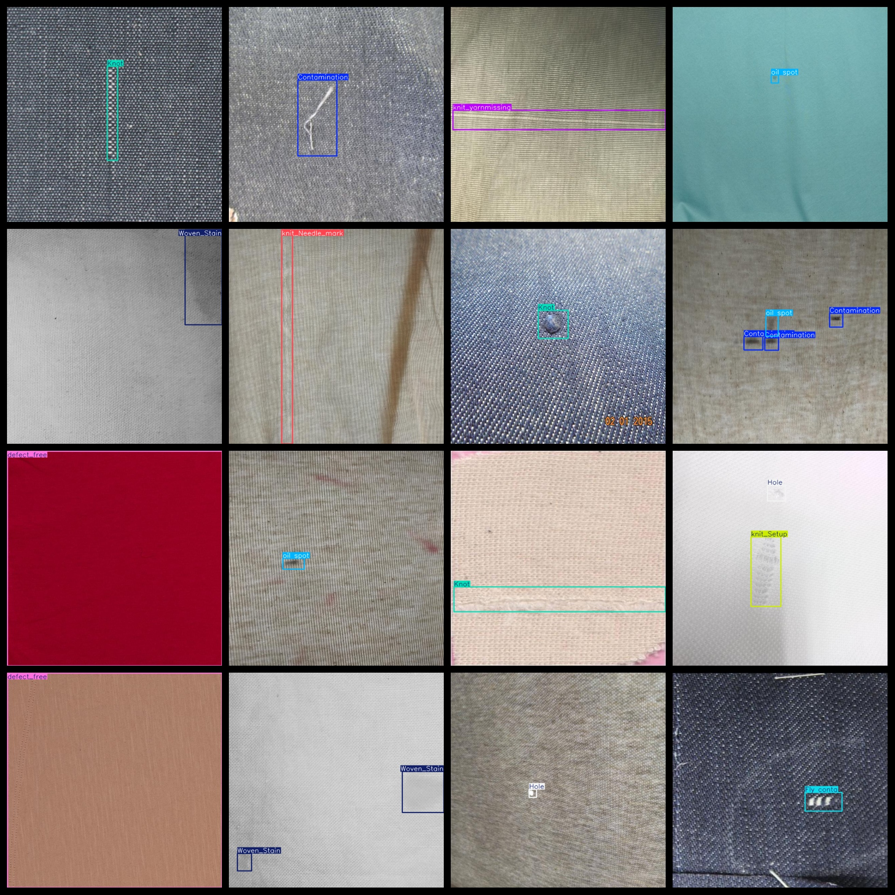

# Fabric Defect Dataset 5085 images in YOLO+VOC format

The fabric defect dataset contains 5085 images in the YOLO+VOC format, organized into three folders for image storage, XML files, and TXT files. The JPEGImages folder contains a total of 5085 jpg images, the Annotations folder contains a total of 5085 xml files, and the labels folder contains a total of 5085 txt files.

The dataset consists of 11 types of labels: "Contamination", "Fly conta", "Hole", "Knot", "Woven_Stain", "defect_free", "knit_Needle_mark", "knit_Setup", "knit_loopmark", "knit_yarnmissing", "oil spot".

Each label has a corresponding number of bounding boxes (please note that the order of categories in the Yolo format does not match this, but is based on the classes.txt file in the Labels folder):

- Contamination: 921
- Fly conta: 704
- Hole: 971
- Knot: 889
- Woven_Stain: 913
- defect_free: 581
- knit_Needle_mark: 743
- knit_Setup: 611
- knit_loopmark: 632
- knit_yarnmissing: 677
- oil spot: 849

Total bounding box count: 8491

All images are in high resolution (pixel count) and are enhanced.

The shapes of the labels are rectangles, used for target detection recognition.

Special Notes: No guarantee is made regarding the precision of models trained with this dataset or any weight files. The dataset provides accurate and reasonable annotations only.

## Images

---

Here is a pay link on Stripe (https://buy.stripe.com/3cs8yP7sY87d0vu9AB). Please contact me lonlonago@foxmail.com after funding $89, and I will send you a complete data files, thank you!

